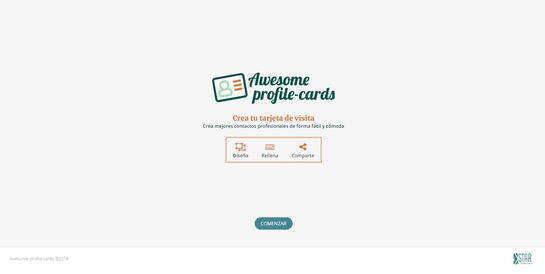
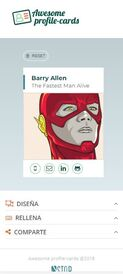
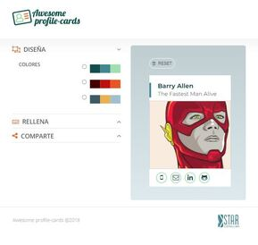
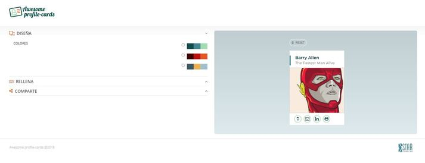

# **ProfileCardsRefactor**

Module 3 Team Project of the Adalab Digital Frontend Development Bootcamp.

This is a profile cards app developed with [](https://html.spec.whatwg.org/) [](https://www.w3.org/Style/CSS/) and [](https://es.reactjs.org/).

## **Authors**

This project has been developed by Refactorizadas Team:

- **Emma Cebada:** [@Emma-cebada](https://github.com/Emma-cebada)
- **Ana Guerra:** [@anaguerraabaroa](https://github.com/anaguerraabaroa)
- **Celia Martín:** [@Celiamf](https://github.com/Celiamf)
- **Belén Matilla:** [@BMatillaVaras](https://github.com/BMatillaVaras)
- **Lissandra Méndez:** [@lissms](https://github.com/lissms)

## **Quick start guide**

Instructions to start this project:

### **Pre-requirements**

This project runs with [](https://es.reactjs.org/). Start guide [**here**](https://github.com/facebook/create-react-app).

### **Installation**

Once React has been installed:

1. Clone repository
2. Open a terminal
3. Run `npm install` on the terminal to install local dependencies

### **Run project**

Run `npm start` on the terminal:

1. Open the project on the browser using a local server.
2. Refresh browser everytime files contained in `/src` folder are updated.
3. Compiled files contained in `/src` folder and copy them in `/public` folder in order to be prepared for production environment.

### **Updating**

1. Run these commands to update changes on the project:

```
git add -A
git commit -m "Message commit"
git push
```

2. Run `npm run build` to create `/docs` folder and the production environment version.

3. Run again commands on step 1 to update changes on the project.

4. Project **[URL](https://anaguerraabaroa.github.io/ProfileCardsRefactor/#/)** is also available on GitHub Pages.

## **Project features**

- Refactor module 2 project [**here**](https://beta.adalab.es/project-promo-K-module-02-team-05/) with [](https://es.reactjs.org/).

## **Folder Structure**

```
ProfileCardsRefactor
├── docs
├── node_modules
├── public
├── src
│   ├── components
│   │   ├── Create
│   │   │   ├── CardImage.js
│   │   │   ├── Design.js
│   │   │   ├── Fill.js
│   │   │   ├── FormItem.js
│   │   │   ├── Info.js
│   │   │   ├── Palettes.js
│   │   │   └── Share.js
│   │   ├── App.js
│   │   ├── CardGenerator.js
│   │   ├── CardIcons.js
│   │   ├── Footer.js
│   │   ├── Header.js
│   │   ├── Landing.js
│   │   ├── Loading.js
│   │   ├── Main.js
│   │   ├── MainSectionCard.js
│   │   └── MainSectionCreate.js
│   ├── images
│   │    ├── batman_loading.gif
│   │    ├── Flash.png
│   │    ├── header_logo.png
│   │    ├── landing_desktop.jpg
│   │    ├── landing_mobile.jpg
│   │    ├── landing_tablet.jpg
│   │    ├── logoStarCodingLabs-Blue.svg
│   │    ├── profile_cards_desktop.jpg
│   │    ├── profile_cards_mobile.jpg
│   │    ├── profile_cards_tablet.jpg
│   │    └── tarjetas-molonas.svg
│   ├── services
│   │    └── fetch.js
│   ├── stylesheets
│   │   ├── core
│   │   │   ├── _reset.scss
│   │   │   └── _variables.scss
│   │   ├── layout
│   │   │   ├── _cardIcons.scss
│   │   │   ├── _design.scss
│   │   │   ├── _fill.scss
│   │   │   ├── _footer.scss
│   │   │   ├── _header.scss
│   │   │   ├── _info.scss
│   │   │   ├── _landing.scss
│   │   │   ├── _loading.scss
│   │   │   ├── _main.scss
│   │   │   ├── _mainSectionCard.scss
│   │   │   ├── _mainSectionCreate.scss
│   │   │   ├── _share.scss
│   │   │   └──
│   │   ├── pages
│   │   │   └── _index.scss
│   │   └── App.scss
│   ├── index.js
│   └── reportWebVitals.js
├── .gitignore
├── debug.log
├── LICENSE
├── package-lock.json
├── package.json
└── README.md

```

## **Components and functions**

### **App component**

- **Render landing and card generator components:** class App extends React.Component

### **Header component**

- **Render header**: class Header extends React.Component

### **Landing component**

- **Render landing:** class Landing extends React.Component

### **Footer component**

- **Render footer:** class Footer extends React.Component

### **CardGenerator component**

- **Handle app:** class CardGenerator extends React.Component
- **Handle form fields data**: handleInputChange
- **Handle reset form filters:**: handleReset
- **Handle api request and response to share card on Twitter:** sendRequest
- **Handle set data in LocalStorage and lifecycle:** setLocalStorage(), componentDidUpdate()
- **Handle get data from LocalStorage and lifecycle:** getLocalStorage(), componentDidMount()

### **Main component**

- **Render MainSectionCard and MainSectionCreate components**: class Main extends React.Component

### **MainSectionCreate component**

- **Render Design, Fill and Share components:** class MainSectionCreate extends React.Component

### **Info component**

- **Render collapsables header:** class Info extends React.Component

### **Design component**

- **Event listener collapsable**: collapseDesign()
- **Render palettes components:** class Design extends React.Component

### **Palettes component**

- **Event listener selected palette**: handleChange
- **Render colour palettes:** class Palettes extends React.Component

### **Fill component**

- **Event listener collapsable**: collapseFill()
- **Render form inputs components:** class Fill extends React.Component

### **FormItem component**

- **Event listener inputs value**: handleChange
- **Render form inputs:** class FormItem extends React.Component

### **CardImage component**

- **Event listener image upload:** fakeClick()
- **Handle get image:** handleCardImg()
- **Render image on the profile card:** writeImage()
- **Render CardImage component:** class CardImage extends React.Component

### **Share component**

- **Event listener collapsable**: collapseShare()
- **Event listener create card link**: createCard()
- **Render share component:** class Share extends React.Component

### **Loading component**

- **Render loading between api request and response:** const Loading

### **MainSectionCard component**

- **Event listener reset button**: handleReset
- **Render profile card and social media navigation menu components:** class MainSectionCard extends React.Component

### **CardIcons component**

- **Render social media navigation menu data on profile card:** class CardIcons extends React.Component

## **Project captures**

  

  

## **License**

This project is licensed under [**MIT License**](https://spdx.org/licenses/MIT.html).
